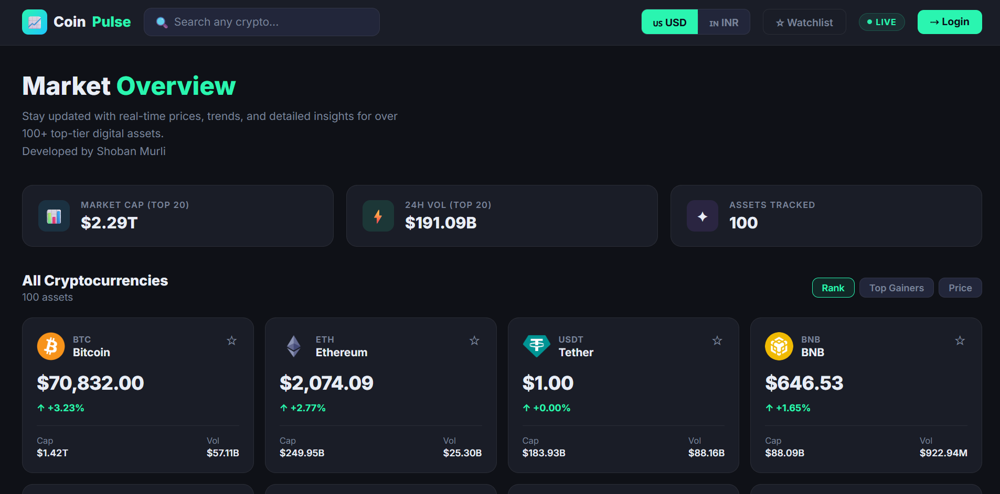
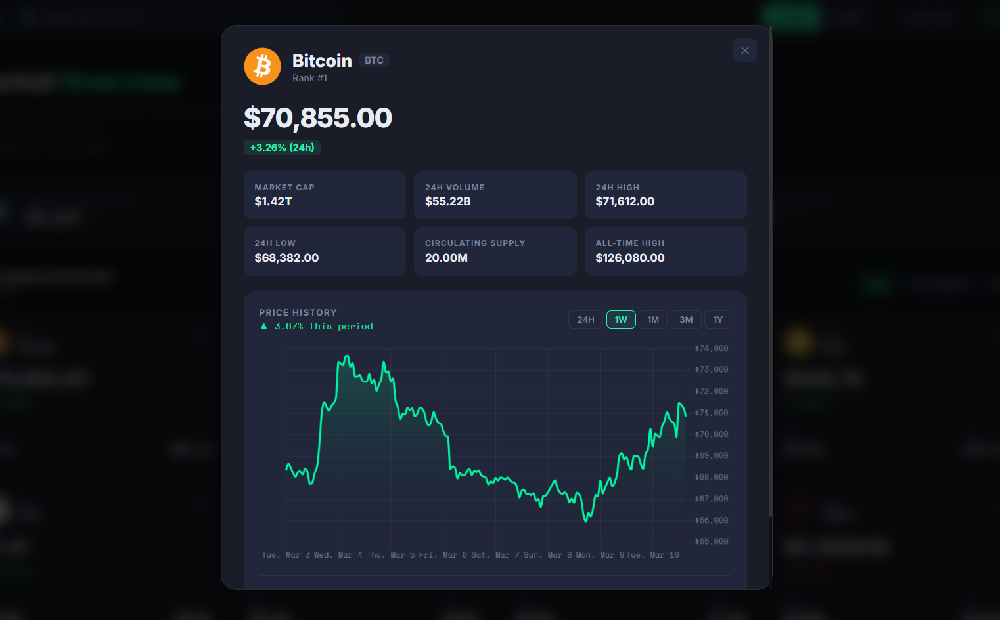

# 🪙 CoinPulse — Live Crypto Tracker

A full-featured crypto tracking app built with React, Firebase, and the CoinGecko API.  
No build tools required — just open with a local server and it works.

---

## 📁 Folder Structure

```
coinpulse/
│
├── index.html                    ← Entry point: loads styles + scripts
│
├── styles/
│   ├── variables.css             ← All CSS design tokens (colours, etc.)
│   ├── base.css                  ← Reset, body, layout, shared utilities
│   ├── nav.css                   ← Sticky navbar, logo, currency selector
│   ├── cards.css                 ← Coin card grid + card internals
│   ├── modal.css                 ← Modal backdrop + CoinModal stats grid
│   ├── chart.css                 ← PriceChart container + time buttons
│   ├── search.css                ← SearchBar input + dropdown panel
│   └── auth.css                  ← AuthModal form + Google button
│
└── src/
    ├── App.jsx                   ← Root component, all global state
    │
    ├── firebase/
    │   └── loader.js             ← Loads Firebase SDK → window._firebase
    │
    ├── utils/
    │   ├── firebase.utils.js     ← getFirebase() with project config
    │   └── formatters.js         ← fmt.price / fmt.pct / fmt.large + CURRENCIES
    │
    └── components/
        ├── Sparkline.jsx         ← Mini 7-day chart on coin cards
        ├── PriceChart.jsx        ← Full interactive chart (zoom, pan, crosshair)
        ├── CoinCard.jsx          ← Single coin card in the grid
        ├── CoinModal.jsx         ← Coin detail overlay with stats + chart
        ├── SearchBar.jsx         ← Navbar search with live dropdown
        └── AuthModal.jsx         ← Google + email/password sign-in modal
```

---

## ✨ Features

| Feature | Detail |
|---|---|
| Live prices | Top 100 coins from CoinGecko, auto-refreshes every 60 s |
| Smart search | Instant dropdown · logo, price, rank · ↑↓ keyboard nav |
| Interactive charts | Zoom, pan, crosshair, 24H/1W/1M/3M/1Y ranges |
| Watchlist | Star coins · persisted in localStorage |
| Firebase Auth | Email/password + Google Sign-in |
| Currency toggle | 🇺🇸 USD / 🇮🇳 INR — all prices update instantly |
| Sort | By Rank · Top Gainers · Price |

---

## 🚀 Running the app

> ⚠️ **Do NOT open `index.html` directly as `file://`** — Google Sign-in won't work.
> Email/password sign-in works fine without a server.

**VS Code (easiest)**
1. Install the **Live Server** extension
2. Right-click `index.html` → **Open with Live Server**
3. Opens at `http://127.0.0.1:5500`

**Terminal**
```bash
npx serve .          # → http://localhost:3000
# or
python -m http.server 8080   # → http://localhost:8080
```

---

## 🔥 Firebase

The app ships pre-connected to the `crypto-currency-1eaee` Firebase project.

To use **your own project**, edit `src/utils/firebase.utils.js` and replace `firebaseConfig`.  
Then in Firebase Console:
1. Enable **Email/Password** and **Google** under Authentication → Sign-in method
2. Create a **Firestore Database** (test mode is fine to start)
3. Add `localhost` under Authentication → Settings → Authorized domains

**Firestore security rules:**
```
rules_version = '2';
service cloud.firestore {
  match /databases/{database}/documents {
    match /users/{userId} {
      allow read, write: if request.auth != null && request.auth.uid == userId;
    }
  }
}
```

---

## ⌨️ Keyboard shortcuts (Search)

| Key | Action |
|---|---|
| `↑` / `↓` | Navigate results |
| `Enter` | Open coin detail |
| `Esc` | Close search |



